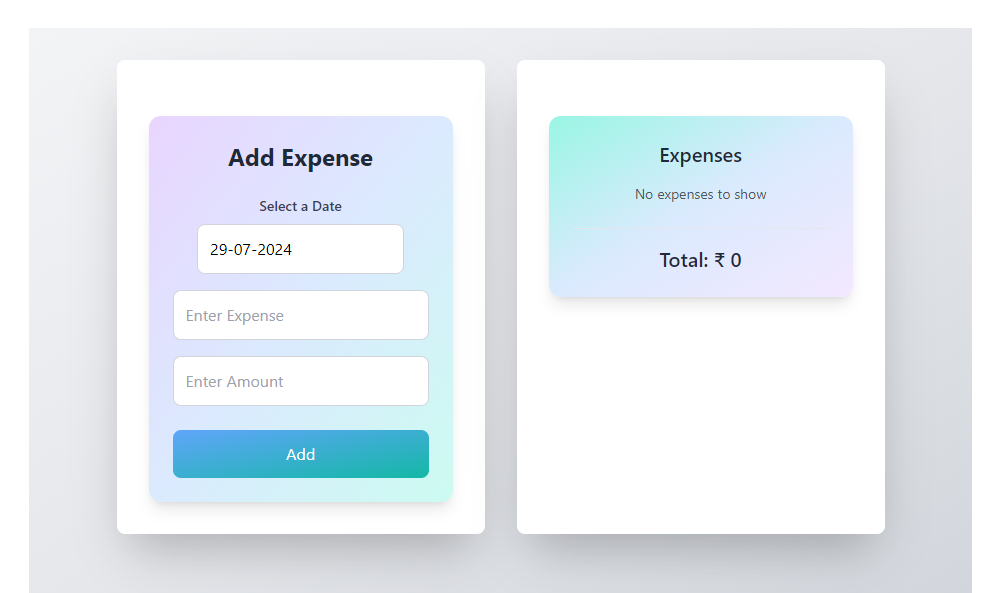

# Expense Tracker

An Expense Tracker application built with React and Redux to manage personal expenses efficiently. This application allows users to add expenses with a specific date, view the list of expenses, and see the total expenditure.

## Demo and Live Link

https://expense-tracker-gamma-azure.vercel.app/





## Features

- **Add Expense:** Users can add an expense by selecting a date, entering the expense name, and the amount.
- **Expense List:** Displays a list of all added expenses.
- **Total Expense Calculation:** Shows the total amount of all expenses.
- **State Management:** Utilizes Redux for managing the application's state.
- **Date Selection:** Uses React Date Picker for selecting dates.
- **Form Input Handling:** Employs HTML5 input attributes like `inputMode='numeric'` and `pattern='[0-9]*'` for better numeric input handling.

## Technologies Used

- **React:** For building the user interface.
- **Redux:** For state management.
- **React Date Picker:** For date selection.
- **Date Fns:** For date manipulation and formatting.
- **Tailwind CSS:** For styling the application.

## Learning Outcomes

While developing this application, the following concepts and techniques were learned:

- **Redux State Management:**
  - Setting up the Redux store.
  - Creating actions and reducers.
  - Managing state within the Redux store.
- **Form Input Handling:**
  - Using `inputMode='numeric'` and `pattern='[0-9]*'` attributes for numeric inputs.
- **Date Handling:**
  - Implementing React Date Picker for date selection.
  - Using Date Fns for date manipulation.
- **Tailwind CSS:** Styling components using Tailwind CSS, with assistance from ChatGPT.

## How to Use

1. Clone the repository:
   ```sh
   git clone https://github.com/itsonlyTushar/expense-tracker.git
