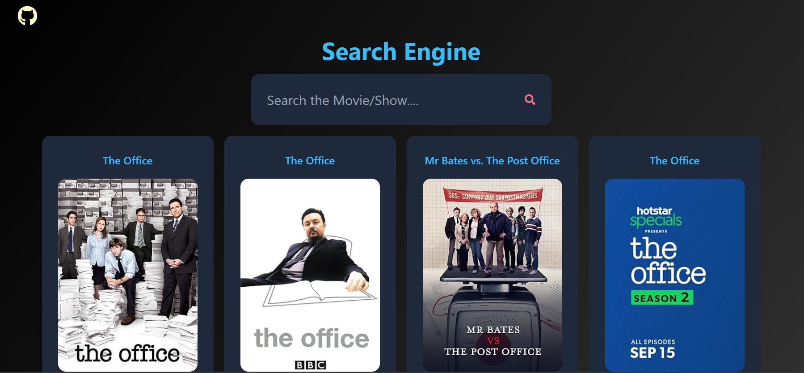

# Movie Search Engine

This is a React application that allows users to search for movies using the OMDB API. The application displays movie posters, titles, IMDb ratings, and other ratings from various sources.

# Demo




## Features

- **Search Movies:** Users can search for movies by title.
- **Movie Details:** Display movie title, poster, IMDb rating, and other ratings.
- **Responsive Design:** The application is responsive and works well on different screen sizes.

## Technologies Used

- **React:** JavaScript library for building user interfaces.
- **Tailwind CSS:** Utility-first CSS framework for styling.
- **OMDB API:** Source of movie data.
- **React Icons:** Icon library for React.

## Lessons Learned

### API Handling

- Fetching data from the OMDB API.
- Handling asynchronous operations using `async` and `await`.
- Managing state using React's `useState` and `useEffect` hooks.

### `_blank` Attribute

- Using the `_blank` attribute in HTML to open links in a new tab.

### Tailwind CSS Classes

- Using Tailwind CSS classes for styling components.
- Creating responsive layouts with Tailwind's utility classes.
- Customizing styles using Tailwind's configuration.

## Articles That Helped Me

1. [Movie Search Engine using React and API](https://www.geeksforgeeks.org/movie-search-engine-using-react-and-api/)
2. [Open Hyperlink in a New Window](https://www.w3docs.com/snippets/html/open-hyperlink-in-a-new-window.html)

## Installation

1. Clone the repository:

   ```bash
   git clone https://github.com/yourusername/movie-search-engine.git
